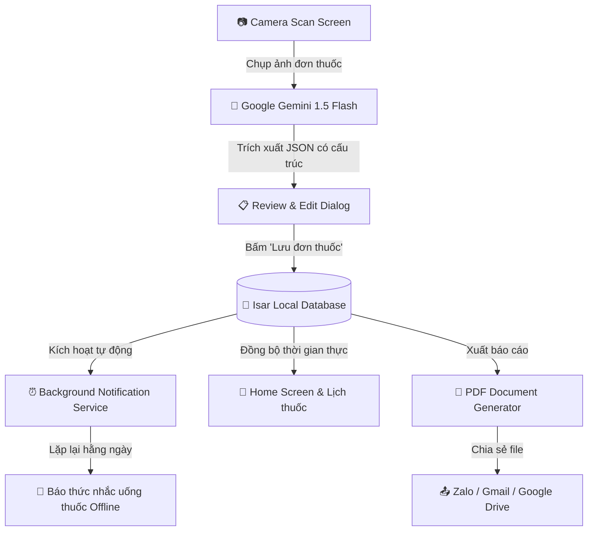

# 🌟 CareLens - Trợ Lý Sức Khỏe & Quản Lý Đơn Thuốc Thông Minh

<p align="center">
  
  
  
  
  
</p>

---

## 📖 Giới thiệu (Overview)

**CareLens** là ứng dụng di động được thiết kế chuyên biệt nhằm giải quyết bài toán quản lý đơn thuốc và theo dõi lịch uống thuốc cho **người cao tuổi Việt Nam** cũng như người thân chăm sóc.

Với tôn chỉ **"Đơn giản - Rõ ràng - Độ tương phản cao - Hoạt động Offline hoàn hảo"**, CareLens loại bỏ sự phức tạp của các ứng dụng y tế truyền thống, mang lại trải nghiệm an tâm, dễ sử dụng cho người lớn tuổi.

---

## 🎨 Triết lý Thiết kế Thân thiện cho Người Cao Tuổi (Senior-Friendly UI/UX)

- 👁️ **Độ tương phản cao (High-Contrast Dark Theme)**: 
  - Nền chủ đạo: **Deep Navy** (`#0A192F`) & **Navy Light** (`#112240`).
  - Màu nhấn hành động: **Accent Green** (`#10B981`) & **Warning Orange** (`#F59E0B`).
  - Giúp mắt người cao tuổi không bị chói lóa, dễ phân biệt ranh giới các thành phần.
- 🔤 **Typography kích thước lớn (Large Typography)**:
  - Tiêu đề màn hình: **`26sp - 32sp`** (In đậm).
  - Tên thuốc & thông tin chính: **`20sp - 22sp`**.
  - Nội dung & hướng dẫn: **`>= 18sp`** (Đảm bảo tiêu chuẩn tiếp cận WCAG AAA).
- 👆 **Chống bấm nhầm (Anti-Accidental Touch Design)**:
  - Chiều cao nút bấm: **`64px - 72px`** với vùng đệm rộng (Padding `>= 20px`).
  - Toàn bộ diện tích thẻ thuốc đều có thể chạm để đánh dấu trạng thái "Đã uống" / "Chưa uống".
  - Phản hồi rung xúc giác (`HapticFeedback`) và thông báo SnackBar nổi bật mỗi khi thao tác.

---

## 🏗️ Kiến trúc Hệ thống (Clean Architecture & Tech Stack)

CareLens được xây dựng theo chuẩn **Clean Architecture**, phân tách độc lập các tầng:

```
lib/
├── core/                               # Tầng dùng chung toàn ứng dụng
│   ├── constants/                      # Hằng số, API config, Routes (app_constants.dart)
│   ├── models/                         # Isar Schemas (prescription.dart, prescription.g.dart)
│   ├── services/                       # Singletons: Gemini, Isar, Notifications, PDF Export
│   ├── theme/                          # Hệ thống màu sắc & typography (app_theme.dart)
│   └── utils/                          # Hàm định dạng ngày giờ, trạng thái sức khỏe
├── features/                           # Tầng chức năng (Feature-first)
│   ├── home/screens/                   # Màn hình Lịch thuốc hôm nay (home_screen.dart)
│   ├── scan/screens/                   # Camera Scanner & Gemini OCR (scan_screen.dart)
│   └── report/screens/                 # Báo cáo & Xuất tệp PDF (report_screen.dart)
├── app.dart                            # Root MaterialApp & Navigation Shell (3 Tab)
└── main.dart                           # Điểm khởi động ứng dụng & Services Bootstrap
```

### Sơ đồ luồng hoạt động (Data & AI Pipeline)



---

## ⚡ Các Tính năng Nổi bật (Key Features)

| Tính năng | Mô tả chi tiết |
|---|---|
| **1. Lịch thuốc & Tiến độ ngày** | Hiển thị danh sách thuốc cần uống hôm nay, thanh tiến độ trực quan, chạm 1 chạm để đổi trạng thái "Đã uống" (Xanh) / "Chưa uống" (Cam). |
| **2. Quét đơn thuốc bằng AI (OCR)** | Live Camera với khung ngắm định vị và đường quét Laser animation. Sử dụng **Gemini 1.5 Flash** để tự động đọc tên thuốc, liều lượng, giờ uống, và lời dặn bác sĩ. |
| **3. Xem lại & Chỉnh sửa thông tin** | Hộp thoại xem lại với cỡ chữ 20sp, cho phép người dùng hoặc con cháu kiểm tra, chỉnh sửa trước khi lưu vào máy. |
| **4. Báo thức nhắc nhở Offline** | Tự động lên lịch thông báo lặp lại hằng ngày theo giờ uống (`zonedSchedule` với múi giờ Việt Nam `Asia/Ho_Chi_Minh`), hoạt động hoàn toàn không cần Internet. |
| **5. Xuất báo cáo PDF & Chia sẻ** | Tự động tạo tệp PDF báo cáo y tế chuẩn hóa tiếng Việt, hỗ trợ chia sẻ trực tiếp qua Zalo, Email, hoặc in gửi bác sĩ. |

---

## 🔑 Hướng dẫn Cấu hình Gemini API Key

CareLens sử dụng Google Generative AI SDK để phân tích đơn thuốc.

1. Truy cập [Google AI Studio](https://aistudio.google.com/app/apikey) để tạo API Key miễn phí.
2. Mở tệp `lib/core/constants/app_constants.dart`.
3. Thay thế giá trị của `geminiApiKeyDemo`:

```dart
// lib/core/constants/app_constants.dart
class AppConstants {
  // ...
  static const String geminiApiKeyDemo = 'AIzaSyD-YOUR-ACTUAL-GEMINI-API-KEY';
  // ...
}
```

> 💡 **Lưu ý**: Trong môi trường Production, bạn có thể chuyển sang đọc từ biến môi trường (`flutter_dotenv`) hoặc lưu trữ an toàn trong `flutter_secure_storage`.

---

## 🚀 Hướng dẫn Cài đặt & Chạy Ứng dụng (Build & Run)

### Yêu cầu môi trường
- Flutter SDK: `>= 3.13.0`
- Dart SDK: `>= 3.1.0`
- Thiết bị thử nghiệm: Android (Android 6.0 trở lên) hoặc iOS (iOS 12 trở lên)

### Các bước thực hiện

```bash
# 1. Cài đặt các thư viện phụ thuộc
flutter pub get

# 2. Sinh mã nguồn Isar Database (nếu có thay đổi model)
flutter pub run build_runner build --delete-conflicting-outputs

# 3. Kiểm tra tính toàn vẹn mã nguồn
flutter analyze
flutter test

# 4. Chạy ứng dụng trên thiết bị / máy ảo
flutter run

# 5. Đóng gói ứng dụng Android APK Release
flutter build apk --release
```

Tệp APK hoàn thiện sẽ nằm tại: `build/app/outputs/flutter-apk/app-release.apk`.

---

## 📋 Quyền hạn Ứng dụng (Permissions)

Tệp `android/app/src/main/AndroidManifest.xml` đã được cấu hình đầy đủ:
- `android.permission.CAMERA`: Dùng để chụp ảnh đơn thuốc.
- `android.permission.INTERNET`: Kết nối Gemini AI API khi quét đơn.
- `android.permission.POST_NOTIFICATIONS`: Gửi thông báo nhắc nhở trên Android 13+.
- `android.permission.SCHEDULE_EXACT_ALARM` & `USE_EXACT_ALARM`: Đặt lịch báo thức chính xác từng phút.
- `android.permission.RECEIVE_BOOT_COMPLETED`: Tự động khôi phục lịch báo thức sau khi khởi động lại điện thoại.

---

## 📄 Giấy phép (License)

Dự án được phân phối dưới giấy phép [MIT License](LICENSE).
Tự do sử dụng, chỉnh sửa và đóng góp cho cộng đồng y tế và chăm sóc sức khỏe người cao tuổi Việt Nam.
